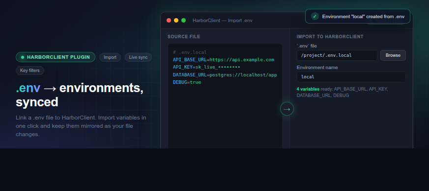

# Dotenv

HarborClient plugin that links a `.env` file to an environment and keeps variables in sync.




## Features

- Pick a `.env` file per collection from Collection Settings → Dotenv
- Create a new HarborClient environment from parsed `.env` values
- Keep the linked environment mirrored to the file with filesystem watch or polling fallback
- Configure key prefix filtering, prefix stripping, and key transforms in Settings → Dotenv Sync

## Permissions

- `ui` — settings panels and collection tab
- `filesystem:pick` — choose `.env` files
- `filesystem:read` — read linked files and watch for changes
- `storage` — persist links and settings

## Development

```bash
pnpm install
pnpm dev
```

Load the unpacked plugin folder in HarborClient Settings → Plugins, or start HarborClient with:

```bash
HARBOR_PLUGINS_DEV=/path/to/harborclient-plugin-dotenv pnpm dev
```

Build a distributable plugin package:

```bash
pnpm pack
```

## Sync behavior

1. Choose a `.env` file and click **Sync now**.
2. Enter a name for the new environment on first sync.
3. Enable **Keep in sync** to automatically push file changes into the linked environment.

When filesystem watch is unavailable, the plugin polls at the configured interval from Settings → Dotenv Sync.
